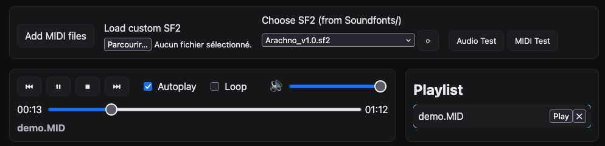

# CBB MIDI Player

🎵 Live demo available [here](https://e-dervieux.github.io/CBB_MIDI_Player/)! 🎵



**⚠️   Disclaimer   ⚠️**

CBB MIDI Player stands for *Crappy* Browser-Based MIDI Player. Crappy because I don't know anything about: web development, javascript (from which I stay as far as possible), the [FluidSynth](https://www.fluidsynth.org/) API, or the [js-synthesizer](https://github.com/jet2jet/js-synthesizer/tree/main) library. I achieved this by heavily relying on CursorAI, and trial-and-error smoke-testing. I did try to prompt the AI to make the app more robust though, to comment its code, *etc.*, but the codebase *may* look like heresy for any expert in the field of web-development. Sorry about that.

Feel free to use it at your own risk. I made this mainly for fun, and to have a usable MIDI player at hand, which *(i)* can run on any platform, *(ii)* runs locally and *(iii)* allowed me to use my own soundfonts without loading times (as opposed to many web-based MIDI players that can be found out there). Still I **do** intend to maintain this and fix bugs as they arise so don't hesitate to contribute.


## About

This is a browser-based MIDI player with SoundFont (SF2) support using [js-synthesizer](https://github.com/jet2jet/js-synthesizer/tree/main) (a [FluidSynth](https://www.fluidsynth.org/) WASM port). It includes a playlist, timeline, play/pause/stop, Autoplay, Loop, MIDI Test, SF2 folder scan, and background-safe handling.

This player comes with the [Microsoft GS Wavetable Synth](https://web.archive.org/web/20250616150719/https://midis.fandom.com/wiki/Microsoft_GS_Wavetable_Synth) soundfont, and a demo MIDI file (main menu music from *Heroes of Might and Magic II*). You may find other soundfonts [here](https://github.com/bratpeki/soundfonts) and [there](https://github.com/ad-si/awesome-soundfonts) if need be, also check this [Reddit thread](https://www.reddit.com/r/midi/comments/pmh94q/whats_the_best_allaround_soundfont/).

## Features
- Playlist of local MIDI files (you can add multiple tracks at once)
- Load SF2 from file or pick one from `Soundfonts/` dropdown (folder scan to automatically add SF2 files to the dropdown)
- Timeline/seek, volume, Play/Pause/Stop/Rewind
- Autoplay (plays next track when the current one ends) and Loop (loop on the current track if autoplay is disabled, or loop on all tracks if autoplay is enabled)
- “Audio Test” (should play a 1 s test tone) and “MIDI Test” (should play a short MIDI test using a piano sound) buttons
- Background-tab safe (will continue playing when the tab is in the background)
- “Low-power” idle: after 30s paused or upon stopping the player, audio graph is suspended/disconnected

## Requirements and installation

  - Node.js 18+ (for building the project)
  - Python 3 or any static HTTP server (for serving the built app)
  - Modern browser (Chrome/Firefox). Use a server – do **not** open `index.html` via `file://`
  
### Development Mode

For development with hot-reloading:

```bash
npm install
npm run dev
```

Then open [`http://localhost:8000`](http://localhost:8000) in your browser.

### Production Build

To build and serve the production version:

```bash
npm install
npm run serve
```

This will build the project into the `dist/` folder and serve it at [`http://localhost:8000`](http://localhost:8000).

Alternatively, you can build and serve separately:

```bash
npm run build
python3 -m http.server 8000 --directory dist
```

## Usage

1. **Audio Test** plays a 1s test tone to verify audio output.
2. **Load SF2**: 
   - On **GitHub Pages**: The dropdown shows pre-bundled SF2 files from the `sound_data/Soundfonts/` folder
   - **Locally**: The refresh button (⟳) scans for new SF2 files you add to `sound_data/Soundfonts/`
   - You can also load any SF2 file via the "Load custom SF2" file input
3. **Add MIDI files** to select one or more `.mid`/`.midi` files from your computer.
4. Select a track in the playlist and press **Play**. Available controls:
   - Timeline seek and volume slider
   - **Autoplay**: plays next track when current one ends
   - **Loop**: loops current track (or entire playlist if autoplay is on)
5. **Keyboard shortcuts**:
   - `Space` - play/pause
   - `S` - stop
   - `ArrowRight` - next track
   - `ArrowLeft` - previous track
   - `ArrowDown` - rewind to beginning
6. **MIDI Test** plays a short C–E–G arpeggio to verify MIDI playback.
7. **Refresh SF2** button (⟳) rescans the `sound_data/Soundfonts/` folder (works only when served locally with directory listing enabled).

## Known issues

In rare cases, the string synths do not off, quickly turning the music into some horrid mess. This is under investigation and I don't know if it's a bug in the library (FluidSynth or its WASM port) or in my code. It might also be a problem in the MIDI files themselves, with no `OFF note` messages...

## License

  - Do whatever you want with the code, I hope it works.
  - I don't know the license of the Microsoft GS Wavetable Synth, and put it here for convenience. Rights reserved to the original authors.
  - All praise Paul Romero and Rob King for the sublime soundtrack of *Heroes of Might and Magic II*, all credits is theirs. I included their music as a tribute, no copyright infringement intended.
